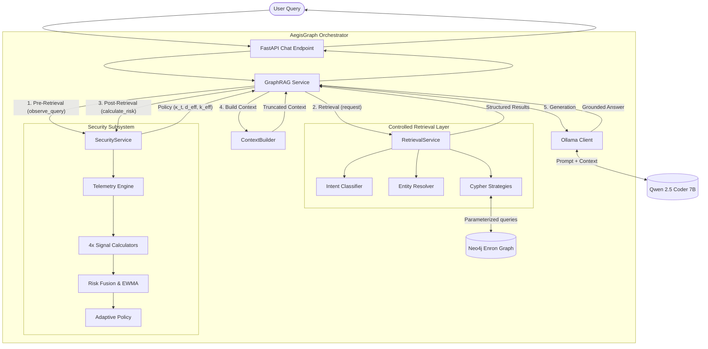

# AegisGraph — Master Technical Architecture

## 1. Project Overview

**AegisGraph** is a research prototype implementing a behavioral security layer for Graph-RAG (Retrieval-Augmented Generation) systems. 

Unlike traditional static Role-Based Access Control (RBAC), AegisGraph dynamically modulates information exposure based on the real-time behavioral risk of the user's querying patterns. It detects suspicious exploration, entity-focused probing, and deep graph traversal, smoothly degrading system utility (context limits and graph depth) to contain potential data exfiltration while preserving utility for benign users.

## 2. System Architecture

AegisGraph is structured as a pipeline with a secure orchestration layer acting as a mediator between the user, the graph database, and the LLM.

## 3. Technology Stack

- **Backend**: Python 3.10+, FastAPI, Pydantic
- **Graph Database**: Neo4j 5.x (Async Python Driver)
- **LLM Engine**: Ollama (local execution)
- **Primary Model**: Qwen 2.5 Coder 7B (`qwen2.5-coder:7b`)
- **Embedding Model**: `sentence-transformers` (`all-MiniLM-L6-v2`)
- **NLP**: spaCy (`en_core_web_sm`) for initial dataset entity extraction

## 4. Component Details

### 4.1. The Graph Database (Phase 1)
A highly curated 50,042-email subset of the CMU Enron Corpus, structured as a multi-hop knowledge graph.
- **Nodes**: `Employee`, `Email`, `Chunk`, `Entity`
- **Edges**: `SENT`, `RECEIVED_BY`, `CONTAINS`, `MENTIONS`, `RELATED_TO`
- See [Phase1_Dataset_and_Graph_Foundation.md](./Phase1_Dataset_and_Graph_Foundation.md)

### 4.2. Controlled Retrieval Layer (Phase 2)
The sole interface to Neo4j. Prevents arbitrary Cypher execution, enforces intent classification, and provides structural safeguards (parameterization, hard limits).
- See [Phase2_Controlled_Retrieval.md](./Phase2_Controlled_Retrieval.md)

### 4.3. Baseline Graph-RAG (Phase 3)
Connects retrieval to the LLM via deterministic context construction. Ensures grounding instructions and length truncation.
- See [Phase3_Baseline_Graph_RAG.md](./Phase3_Baseline_Graph_RAG.md)

### 4.4. Behavioral Telemetry & Risk Model (Phase 4A/4B)
Calculates four behavioral signals per query:
1. **Semantic Drift** (`S_sem`): Cosine distance between query embeddings.
2. **Temporal Frequency** (`S_temp`): Exponential decay of inter-arrival time.
3. **Entity Focus** (`S_ent`): Shannon entropy of entity concentration.
4. **Graph Footprint** (`S_graph`): Heuristic graph depth and result volume.

Signals are linearly fused and smoothed via Exponential Weighted Moving Average (EWMA) to produce a session risk score `Γ̄_t`.
- See [Phase4A_Behavioral_Telemetry.md](./Phase4A_Behavioral_Telemetry.md) and [Phase4B_Risk_Model.md](./Phase4B_Risk_Model.md)

### 4.5. Adaptive Policy & Response Control (Phase 4C)
Translates the continuous EWMA risk into concrete system restrictions using a sigmoid attenuation factor (`κ_t`). 
- Limits the number of records passed to the context builder (`effective_context_limit`).
- Blocks intents that require a graph traversal deeper than permitted (`effective_graph_depth`).
- See [Phase4C1_Adaptive_Policy.md](./Phase4C1_Adaptive_Policy.md), [Phase4C2_Policy_Retrieval_Integration.md](./Phase4C2_Policy_Retrieval_Integration.md), and [Phase4C3_Response_Control.md](./Phase4C3_Response_Control.md)

## 5. Security Timing Constraints

A critical architectural invariant is the **Execution Timing**:
1. Policy `t` is calculated based on EWMA `t-1`.
2. Retrieval `t` is restricted by Policy `t`.
3. Telemetry `t` observes Retrieval `t`.
4. EWMA `t` is updated using Telemetry `t`.

This prevents circular dependencies where the current query's results affect its own restrictions.

## 6. End-to-End Evaluation (Phase 4D)

The prototype was evaluated against 8 behavioral scenarios. It successfully demonstrated:
- **0.0% utility degradation** for benign exploration.
- **Graceful limit throttling** during progressive risk escalation.
- **Active blocking** and **41.8% exposure reduction** against sustained multi-vector graph probing.
- See [Phase4D_End_to_End_Evaluation.md](./Phase4D_End_to_End_Evaluation.md)

## 7. Known Limitations and Future Work

1. **Intent-to-Depth Abstraction**: `S_graph` relies on a heuristic mapping of intent to depth rather than parsing physical Neo4j hop counts.
2. **Static Weights**: Risk signals are equally weighted (25% each). Future implementations should utilize learned or domain-tuned weights.
3. **No Dynamic Response**: The LLM system prompt does not dynamically adapt to risk levels (e.g., instructing the LLM to summarize rather than quote at MEDIUM risk).
4. **Rule-Based Classification**: Intent classification uses regex patterns rather than an LLM-based classifier.
5. **Session Isolation**: Risk is calculated per-session. Cross-session or cross-user behavioral aggregation is not implemented.
