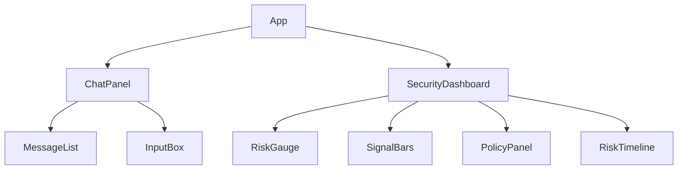

# Phase 6C — Frontend Architecture and Integration Plan

## 1. Current Frontend Inspection Findings
An inspection of the repository root (`backend/` and `data/` directories) reveals that **no frontend codebase currently exists**. The AegisGraph prototype is entirely API-driven at this stage.

## 2. Actual Backend API Contract
The primary integration point is `POST /api/v1/chat`. An inspection of `app/api/chat.py`, `app/rag/service.py`, and `app/security/models.py` reveals the following exact contract:

**Request (`ChatRequest`)**:
- `query` (str)
- `session_id` (str, optional)

**Response (`ChatResponse`)**:
- `answer` (str)
- `session_id` (str)
- `intent` (str)
- `status` (str)
- `retrieval` (dict): `{"result_count": int, "strategy": str}`
- `telemetry` (dict): Based on `TelemetryEvent`, containing:
  - `session_id` (str)
  - `timestamp` (float)
  - `query` (str)
  - `intent` (str)
  - `retrieval_strategy` (str)
  - `result_count` (int)
  - `signals` (dict): `semantic_drift`, `temporal_frequency`, `entity_focus`, `graph_footprint`
  - `instantaneous_risk` (float)
  - `smoothed_risk` (float)

### Missing API Fields Identified
While the evaluation scripts in Phase 4 artificially grouped policy data into the telemetry JSON dumps, the actual API `TelemetryEvent` model **lacks** the following critical frontend requirements:
- `policy` object (containing `risk_level`, `attenuation_factor`, `effective_context_limit`, `effective_graph_depth`)
- `blocked_by_policy` boolean status

These fields must be added to the API response in Phase 6D before the frontend can fully visualize the security state.

## 3. Proposed Frontend Architecture
Given the requirement for a professional MVP without overengineering, the recommended stack is:
- **Framework**: React 18 + Vite
- **Language**: TypeScript (for strict typing against the backend contract)
- **Styling**: Tailwind CSS (lightweight, highly customizable for dashboards)
- **Visualization**: Recharts (simple, React-native composable charting)
- **State Management**: React `useState`/`useReducer` and Context API (No Redux needed)

## 4. Component Hierarchy


- **App**: Main layout container, holds the `session_id` and global state.
- **ChatPanel**: Left pane. Handles user input, displays the conversation (queries and LLM answers).
- **SecurityDashboard**: Right pane. Visualizes the telemetry of the *latest* query.
  - **RiskGauge**: Displays `smoothed_risk` (0.0 - 1.0) and categorical `risk_level` (LOW/MEDIUM/HIGH).
  - **SignalBars**: Progress bars for the four signals ($S_{sem}$, $S_{temp}$, $S_{ent}$, $S_{graph}$).
  - **PolicyPanel**: Shows $\kappa_t$ attenuation, $k_{eff}$ limit, $d_{eff}$ depth, and blocking status.
  - **RiskTimeline**: A line chart tracking `smoothed_risk` over the history of the conversation.

## 5. State Management & Session Lifecycle
- **Session Lifecycle**: On the first query, the frontend omits `session_id`. The backend generates and returns a UUID. The frontend stores this UUID in local React state (or `sessionStorage`) and attaches it to all subsequent queries.
- **Telemetry History**: The frontend maintains an array of `TelemetryEvent` objects in state. Every new API response pushes its telemetry to this array, feeding the `RiskTimeline` chart.
- **Backend as Source of Truth**: The frontend performs zero risk calculation. It merely maps the backend API floats to visual components.

## 6. Proposed Folder Structure
```text
frontend/
├── src/
│   ├── api/            # API client and TypeScript interfaces
│   ├── components/
│   │   ├── chat/       # ChatPanel, Message, Input
│   │   ├── dashboard/  # RiskGauge, SignalBars, RiskTimeline
│   │   └── layout/     # App grid layout
│   ├── hooks/          # useChat (manages session state)
│   ├── App.tsx
│   └── main.tsx
├── package.json
└── vite.config.ts
```

## 7. API Integration Flow
1. User types query → hits "Send".
2. `useChat` hook appends user message to UI state.
3. Hook POSTs to `http://localhost:8000/api/v1/chat` with `{ query, session_id }`.
4. Awaits JSON response.
5. Appends backend `answer` to UI chat history.
6. Updates `currentTelemetry` state to drive gauges.
7. Pushes new telemetry to `telemetryHistory` state to drive the timeline chart.

## 8. MVP Scope vs Optional Enhancements
**In Scope (Phase 6 MVP)**:
- Core chat functionality
- Visualizing risk and signals
- Displaying adaptive policy limits
- Session ID persistence in-memory

**Out of Scope**:
- User authentication / Login screens
- Persistent database storage of past chats
- Complex Redux stores
- WebSocket streaming (polling/standard REST is sufficient)

## 9. Exact Recommended Implementation Plan (Phase 6D)
1. **API Patch**: Modify `TelemetryEvent` and `GraphRAGService` in the backend to include `policy` and `blocked_by_policy` in the API response.
2. **Frontend Initialization**: Run `npm create vite@latest frontend -- --template react-ts`.
3. **Dependencies**: Install `axios`, `recharts`, `tailwindcss`, and `lucide-react`.
4. **API Client**: Implement `api.ts` with strict TypeScript interfaces matching the corrected backend contract.
5. **Component Build**: Build the `ChatPanel` and `SecurityDashboard` components.
6. **Integration**: Connect the `useChat` hook to the UI and verify end-to-end telemetry visualization.
